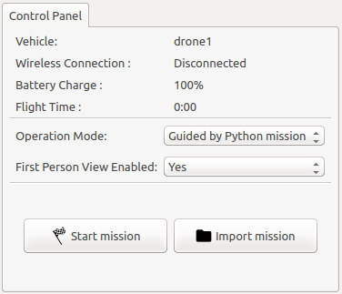

This page shows an example of how to create and execute a mission using Python language and the quadrotor simulator.

### Write a mission in Python

In this example, we specify a simple mission in which the drone performs just three steps: taking off, going to a specific point and landing. The code below must be written in a file called `mission.py` in a configuration folder (for example, the folder `$AEROSTACK_STACK/configs/drone1`).

The complete code in Python is the following:

```python
import executive_engine_api as api

def runMission():
  api.executeBehavior('TAKE_OFF')
  endPoint = [8, 8, 0.7]
  api.executeBehavior('GO_TO_POINT', coordinates=endPoint)
  api.executeBehavior('LAND')
  ```

### The code explained

In the following, we explain line by line the code presented above.

```python
import executive_engine_api as api
```
First, we import the `executive_engine_api package` because it provides the necessary functions to execute behaviors. We have given to it the alias of `api`so we can refer to it in a shorter way.    

```python
def runMission():
```
Then, we have to define the `runMission()` function that is a special function that will get executed when the mission is started.

```python
 api.executeBehavior('TAKE_OFF')
```

Now, we execute different behaviors using the function `executeBehavior()` from `executive_engine_api package` that  executes any behavior and waits for it to complete. It returns a string with the termination status. The available behaviors can be found here:

-   [[Catalog of behaviors]]


The first behavior to execute is `'TAKE_OFF'`that makes the vehicle begin to fly and gain altitude (0.7 meters) .

```python
  endPoint = [8, 8, 0.7]
```
In the previous line we are defining a point called `endPoint`(the point where we want to end the mission before landing) just by giving its three coordinates (x,y,z) in the shape of a Python list.

```python
  api.executeBehavior('GO_TO_POINT', coordinates=endPoint)
```

Then we tell our drone that we want it to go to the specified point. To do so, we execute the `'GO_TO_POINT'`behavior with the `endPoint` as an argument.

```python
    api.executeBehavior('LAND')
```
Finally, we execute the `'LAND'` behavior to make the drone decrease altitude and stop flying in its location.

### Execute the mission with the simple simulator

Now we are going to execute the previous mission. Before all, we have to launch Aerostack with simple simulator. Then, select the `Guided by Python mission` option in the dropdown menu in the middle section of Control Panel. Two new buttons will appear: `Start mission`and `Abort mission`.



Press the `Start mission` and see how, first, the `z`coordinate increases in the Vehicle Dynamics panel. Then the vehicle travels to the predefined `endpoint`(8,8,0.7) and finally it lands at the same location.

  [ ](https://youtu.be/XCKSSSjv0UQ)