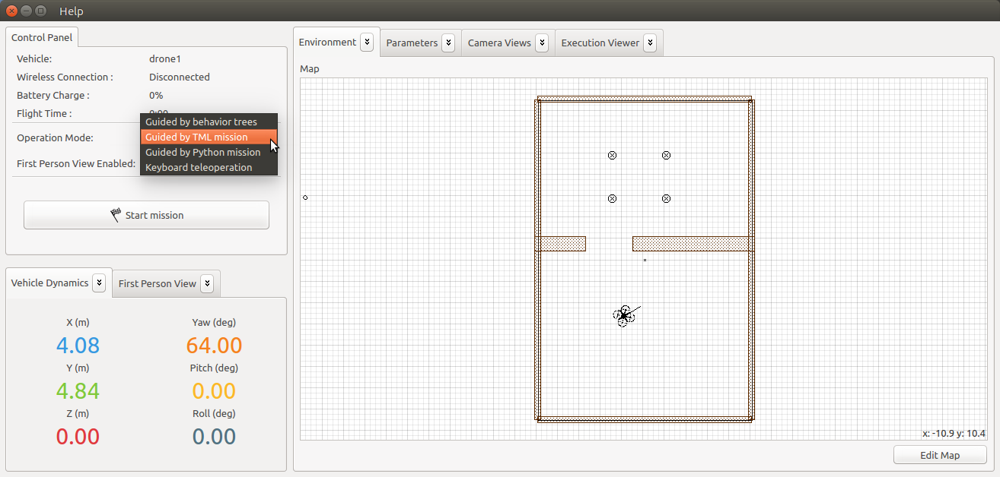
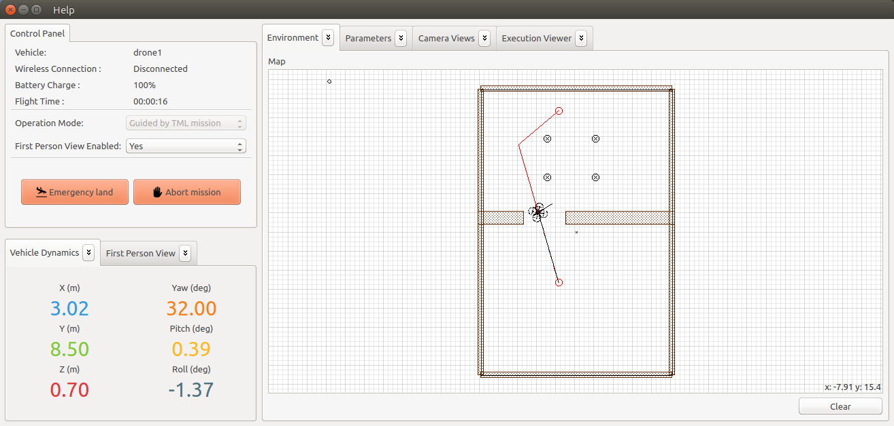

This page describes a simple example that illustrates how to create and execute a mission using the TML language (task-based mission specification language). In this example we assume that the environment map is already created with several obstacles. The mission performs the following steps:

1. Take off
2. Go to point relative coordinates(0,9,0) 
3. Go to point relative coordinates(-3,0,0)
4. Go to point relative coordinates(0,-9,0)
5. Go to point relative coordinates(3,0,0)
6. Land

## Create the TML mission

To be used by the Aerostack, the mission has to be written in a XML file called 'mission_specification_file.xml', which must be located in $AEROSTACK_STACK/configs/ within a folder selected by the operator called drone{Id} ({Id} = 0, 1, 2, ...). Situate on the directory, create or overwrite the XML file and use the following XML code:

```xml
<mission root_task="go and come back">
  <task_tree>
    <task name= "go and come back">
      <task name="Take off">
        <behavior name="TAKE_OFF"/>
      </task>
      <task name="Moving to point A">
        <behavior name="GO_TO_POINT">
          <argument name="relative_coordinates" value="[0, 9, 0]"/>
        </behavior>
      </task>
      <task name="Moving to point B">
        <behavior name="GO_TO_POINT">
          <argument name="relative_coordinates" value="[-3, 0, 0]"/>
        </behavior>
      </task>
      <task name="Moving to point C">
        <behavior name="GO_TO_POINT">
          <argument name="relative_coordinates" value="[0, -9, 0]"/>
        </behavior>
      </task>
      <task name="Moving to point D">
        <behavior name="GO_TO_POINT">
          <argument name="relative_coordinates" value="[3, 0, 0]"/>
        </behavior>
      </task>
      <task name="Final land">
        <behavior name="LAND" />
      </task>
    </task>
  </task_tree>
</mission>
```

Details about the TML language can be consulted here:

- [[TML language]]

## Execute the TML mission

First, start Aerostack. Next change the operation mode to 'Guided by TML mission' in the control panel.

  

Finally, to start the mission you only have press the 'Start' button in the control panel.

  

See here a video that presents a similar example:

[](https://www.youtube.com/watch?v=eDMWYMGftgA)