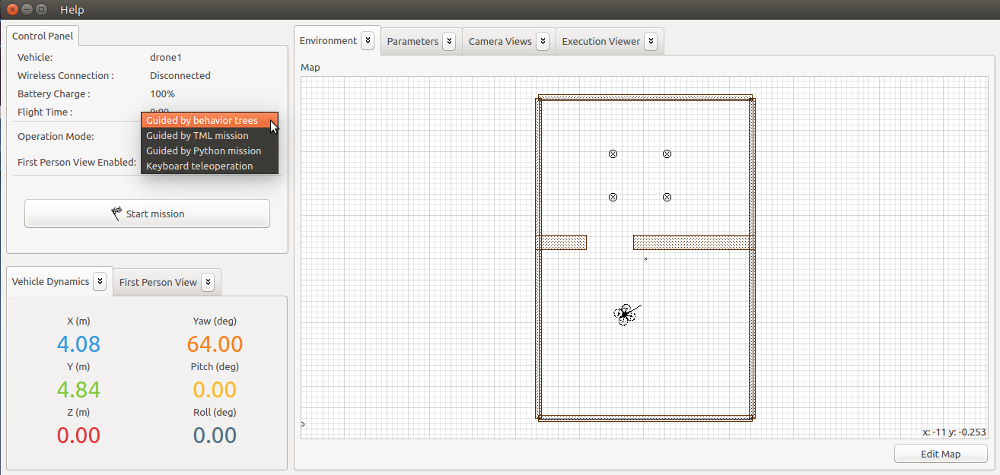
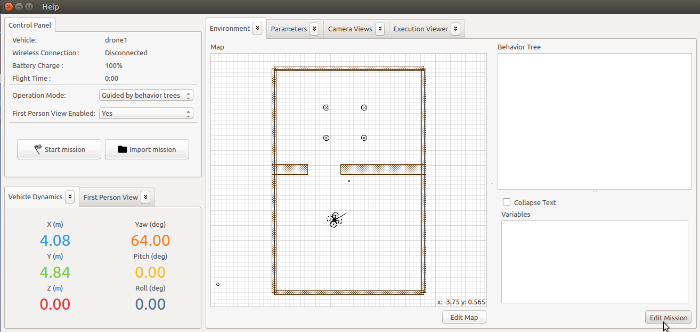
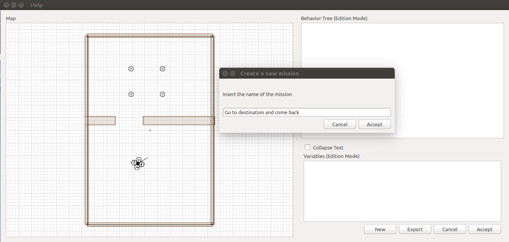
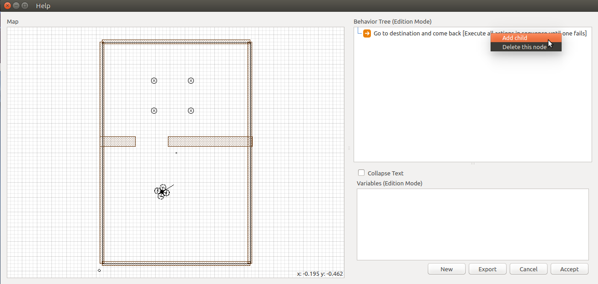
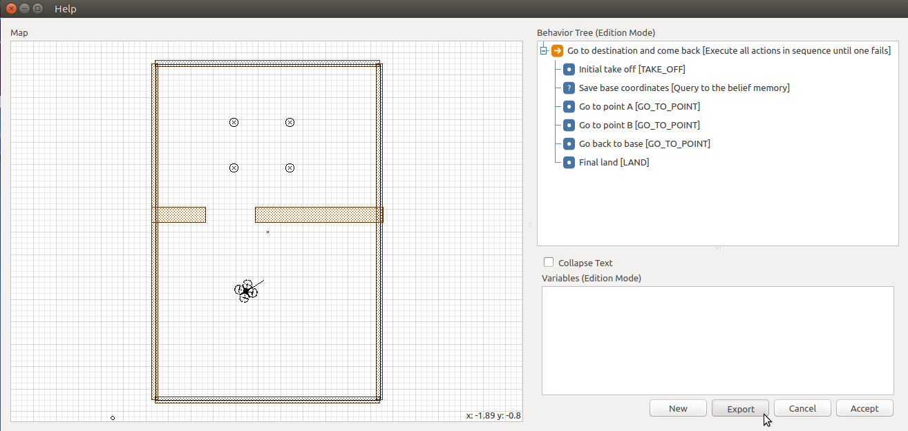

This page describes a simple example that illustrates how to create and execute a mission using a behavior tree. In this example we assume that the environment map is already created with several obstacles. The mission performs the following steps:

1. Take off
1. Save the current position as home base
1. Go to the point A (6,14,1)
1. Go to the point B (1,12,1)
1. Go to home base
1. Land

## Create the behavior tree

You must be in the behavior tree editor mode. First change the operation mode to 'Guided by behavior trees' in the control panel.

  

Next press 'Edit mission' button at the right bottom corner of the window to create a new one. 

  

Once inside the behavior tree editor mode, press 'New' button to create a new behavior tree. A dialog window is displayed asking for the name of mission. It creates a new sequence root node.

  

Now, you can add node children to the root by clicking-right in the root node and select the option 'Add child'. 

  

Create the following children in the following order:

  * Firstly, drone must take off.
  * Save the current position on X, Y and Z variables that you will need later.
  * Order the drone to go the following position: (X=6, Y=14, Z=1). Next order the drone to go: (X=1, Y=12, Z=1).
  * Order the drone to go initial position. Use the variables that you save it when you started.
  * Finally, order the drone land.

Details about the editing a behavior tree can be consulted here:

* How to edit a [[behavior tree]].

When you finish to define the mission you can save the behavior tree in an external file (a .yaml file) by pressing the 'Export' button. This file can be imported later by pressing the 'Import' button.

Finally, click 'Accept' to exit from the edition mode.

## Execute the behavior tree

When you come back to main window, you can see the structure of behavior tree on right. To start the mission you only have press the 'Start' button.The drone will execute the children to the node defined in order.

----

See here a video that presents the complete process:

