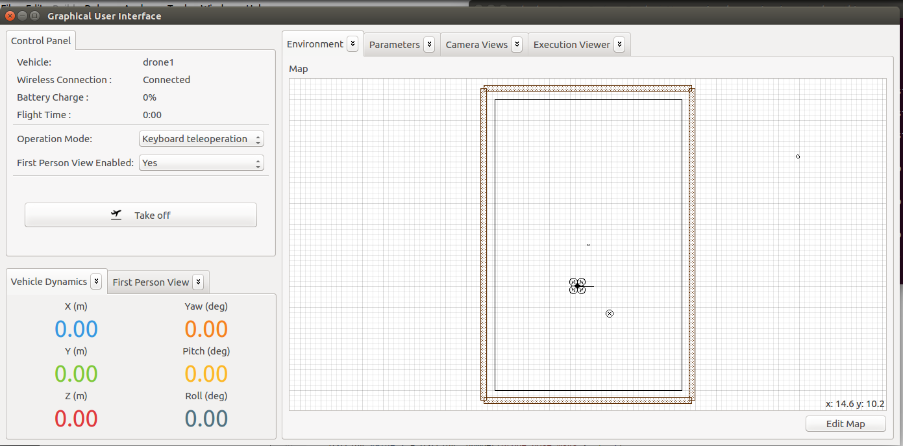

Drone Simulator is a process that simulates the dynamics of a quadrotor. To launch Aerostack with Drone Simulator, perform the following steps:

1. Open a terminal window and execute the ROS Master Node:

         $ roscore
	 
1. Open another terminal and change your current directory to the folder that contains the launchers:

         $ cd $AEROSTACK_STACK/launchers 
	
1. Execute the launcher script:

         $ ./simulated_quadrotor_basic.sh

 4. Three new terminal windows pop up. Wait until they finish executing.

 6. Finally, Aerostack GUI and Rviz will open ready to be used.

See here a video that presents this process:

