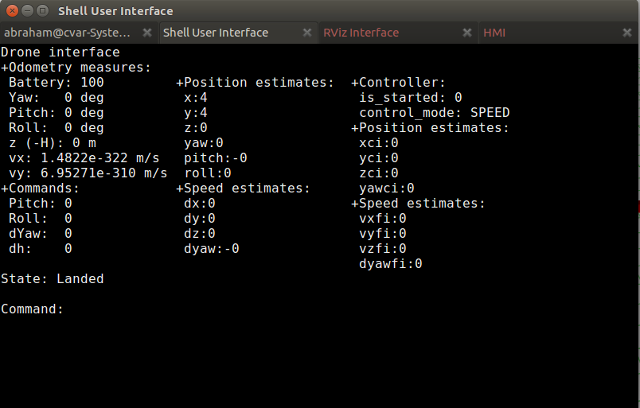

This page explains how to use Aerostack to teleoperate a simulated quadcopter. 

### Using  alphanumeric interface

First, we are going to operate our drone using the [[Alphanumeric User Interface]]. 

See below  the steps  to carry out a simple example mission (round trip):

 1. Press 't' to take off. You will see how z coordinate increases.  
 2. Press 'q' to increase altitude if necessary.
 3. Press 'up arrow' to move frontwards.
 4. Press 'h' to stop the drone and keep it hovering.
 5. Press 'z' to turn the direction counter-clockwise until reaching contrary sense.
 6. Press 'h' to stop turning around.
 7. Press 'up arrow' to move frontwards in the new sense.
 8. Press 'h' to stop moving when arriving at initial point.
 9. Press 'y' to land.

See here a video that presents this process:

### Using the graphical user interface to teleoperate the simulated drone

User can also use the [[Graphical User Interface]] to control the simulated vehicle manually. The operator must select the operation mode (Keyboard teleoperation) by using the dropdown menu in the middle section of the Control Panel. Keyboard teleoperation is the default mode when launching Aerostack. We are going to reproduce the simple example mission carried out before using alphanumeric interface, but this time using the manual teleoperation mode of the graphical user interface.

 1. Make sure that 'Keyboard teleoperation' is selected in Operation Mode dropdown menu.
 2. Click on 'Take off' in the bottom of the Control Panel. Our simulated drone will start flying.
 3. Press 'right arrow' to move frontwards and stop pressing it when you want to stop.
 4. Press 'left arrow' to move backwards and stop pressing it when arriving to the initial point.
 5. Click on 'Land' in the bottom of the Control Panel.

See here a video that presents this process:

